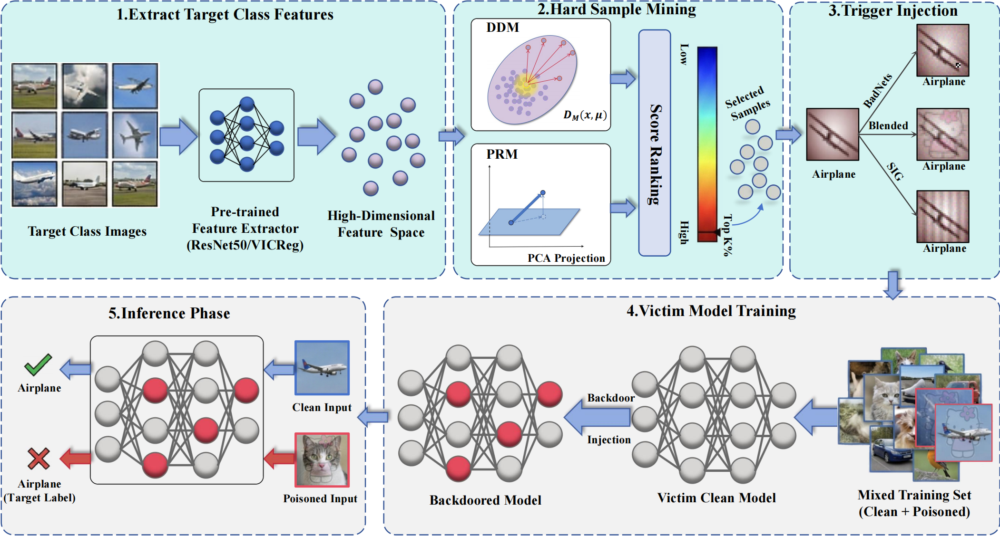

# Selection-Aware Poisoning: Boosting Clean-Label Backdoor Attacks via Distribution Deviation and Projection Residual Metrics
We propose a unified framework for clean-label backdoor attacks that leverages **geometry-aware feature space scoring** to identify the most vulnerable samples for poisoning. By introducing two novel selection strategies — **DDM** and **PRM** — our method significantly improves attack success rates while maintaining high clean accuracy, even under strong defenses.



---


## Requirements

```bash
pip install -r requirements.txt
```

Key dependencies: `torch>=2.8.0`, `torchvision>=0.23.0`, `timm>=1.0.19`, `scikit-learn>=1.7.2`, `tqdm`, `numpy`.

---

## Step 1 — Sample Selection

Find the hardest samples in the target class using a pretrained surrogate model.

```bash
# DDM strategy with VICReg surrogate (recommended)
python python/select_data.py \
    --strategy ddm \
    --model_name vicreg \
    --dset CIFAR10 \
    --target 0 \
    --input_size 224 \
    --device cuda:0
```
Supported strategy: `ddm`, `prm`;

Supported surrogate models: `vicreg`, `resnet50`;

Supported datasets: `CIFAR10`, `GTSRB`;

Scores are saved to `resources/` and consumed automatically by the training script.

---

## Step 2 — Train the Backdoor Model

Edit `run.sh` to configure the attack, then run:

```bash
bash run.sh
```


## Step 3 — Run Defenses

Evaluate a poisoned checkpoint against any of the 14 supported defenses:

```bash
python python/defense.py \
    --defense $DEF \
    --model $MODEL \
    --output_dir $DIR \
    --data-set $DATA \
    --attack_type $ATK \
    --checkpoint $CHECKPOINT_PATH \
    --strategy $STRAG \
    --surrogate_model $SURR_MODEL \
    --attack_label $LABEL \
    --attack_portion 0.1
```

### Supported Defenses

| Flag | Defense | Type |
|------|---------|------|
| `NC` | Neural Cleanse | Trigger reverse-engineering |
| `STRIP` | STRIP | Input filtering |
| `FP` | Fine-Pruning | Model pruning |
| `CD` | Cognitive Distillation | Input denoising |
| `FREQ` | Frequency Analysis | Spectral detection |
| `SS` | Spectral Signatures | Feature clustering |
| `AC` | Activation Clustering | Feature clustering |
| `SPECTRE` | SPECTRE | Robust estimation |
| `CLP` | Channel Lipschitz Pruning | Model pruning |
| `RNP` | RNP | Unlearning + mask recovery |
| `FT-SAM` | Fine-tuning with SAM | Sharpness-aware fine-tuning |
| `IBD_PSC` | IBD-PSC | BN-scaling detection |
| `ASSET` | ASSET | Contrastive loss separation |
| `SCALE_UP` | SCALE-UP | Scaled prediction consistency |

---

## Citation

If you find this repository useful for your research, please cite our paper:

```bibtex
@inproceedings{wang2026selection,
  title     = {Selection-Aware Poisoning: Boosting Clean-Label Backdoor Attacks via Distribution Deviation and Projection Residual Metrics},
  author    = {Xin Wang},
  booktitle = {International Joint Conference on Neural Networks (IJCNN)},
  year      = {2026}
}
```
